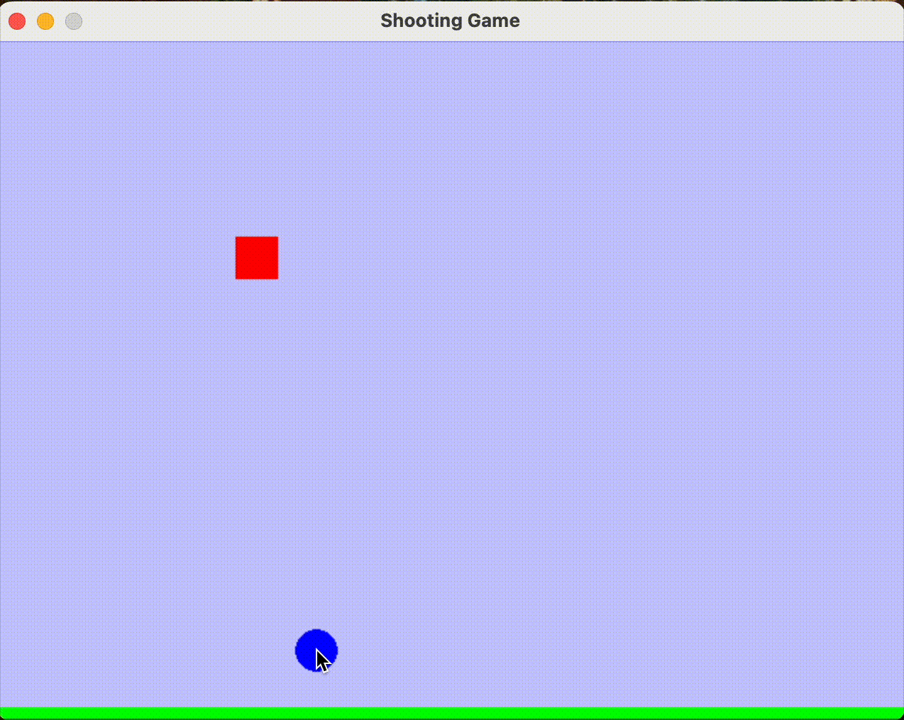

# お手玉シューティングゲーム

## ゲーム概要

変則的なお手玉ゲームです。  
右方向の横スクロールで、下から弾を撃ってキャラクターをゴールに導きます。

- キャラクターは画面左上からスタートし、一定速度で右に移動しながら落下します
- 画面下をクリックすると弾を発射できます
- 弾がキャラクターに当たると、キャラクターは上方向に跳ねます
- 画面右端のゴールに到達するとクリアです
- キャラクターが画面下に落ちるか上に出るとゲームオーバーになります



## 起動方法

```bash
python shooting_game.py
```

### 操作方法

- **マウスクリック**: 弾を発射
- **Rキー**: ゲームをリスタート

## 使用技術

- **ゲームエンジン**: Pygame
- **開発環境**: Python 3.x

## 必要な環境

```bash
pip install pygame
```
